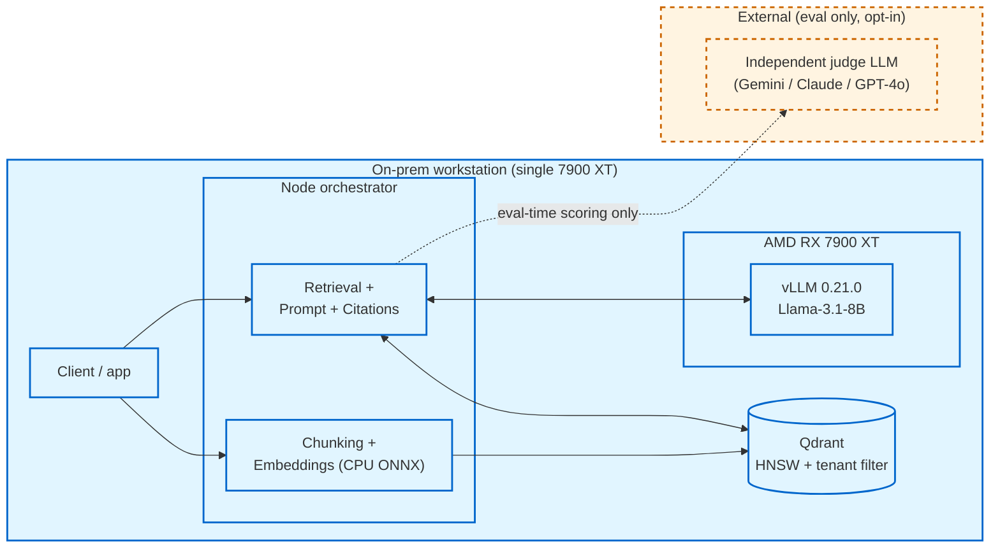

# Enterprise RAG POC — On-Prem RAG on Commodity AMD GPU

A working proof that production-shape Retrieval-Augmented Generation can run **fully on-premises** on consumer AMD hardware, with **enterprise-grade tenant isolation**, **citation-grade auditability**, and **independent measurement** — without sending any user data to a third party.

| | |
|---|---|
| **Hardware** | AMD Radeon RX 7900 XT (24 GB GDDR6, RDNA3 / gfx1100) |
| **Inference** | vLLM 0.21.0 + Llama-3.1-8B-Instruct (fp16) on ROCm 7.2 |
| **Vector store** | Qdrant (HNSW, cosine, payload-filter tenant isolation) |
| **Embeddings** | `Xenova/all-MiniLM-L6-v2` (384-d ONNX, CPU) |
| **Orchestrator** | Node 22 / TypeScript (LangChain v1) |
| **Eval** | Custom harness — retrieval metrics + LLM-as-judge + behavioral assertions |

> **Audience.** This README is the entry point for engineering leadership, architecture reviewers, and anyone deciding whether to build on this POC. For depth, see [docs/](docs/). For the why, see [docs/purpose.md](docs/purpose.md). For technical concepts, see [docs/rag-primer.md](docs/rag-primer.md).

---

## What this is



**Solid arrows are production traffic — fully local.** Dashed arrows are eval-time-only and require explicit opt-in via `JUDGE_ENDPOINT`. See [docs/architecture.md](docs/architecture.md) for full diagrams (ingest sequence, query sequence, trust boundaries, process layout).

---

## Validated results

Last eval run (Gemini 2.5 Flash as independent judge, 2026-05-25):

| Metric | Value | What it means |
|---|---|---|
| **Hit@k** (top-5 retrieval) | **100%** | Every answerable question retrieved its gold chunk in the top-5 |
| **MRR@k** | **1.000** | Gold chunk surfaced in **rank 1** on every single question |
| **Recall@k** | **100%** | All gold sources retrieved |
| **Faithfulness avg** (unbiased judge) | **95%** | Generated answers stay grounded in retrieved context |
| **Relevance avg** (unbiased judge) | **100%** | Answers directly address the questions asked |
| **Tenant isolation** | **3/3** | Cross-tenant probes correctly blocked at Qdrant payload-filter layer |
| **Abstain accuracy** | **5/5** | Unanswerable questions correctly returned "Not supported by available context." |
| **Idempotent re-ingest** | ✅ | `points_count` stable across repeated runs (UUIDv5 content-hash IDs) |
| **Overall pass rate** | **14 / 15** | Single PARTIAL was a real, surfaced faithfulness issue (subtle scope-broadening paraphrase) |

The 14 / 15 is *not* the system underperforming — it's the eval finding a genuine subtle issue (the single PARTIAL flagged a real grounding gap that a same-model judge missed). That is exactly what an eval harness is supposed to do. See [docs/eval.md](docs/eval.md) for methodology and the same-model-bias finding.

---

## Why this exists

Default reflex: use a managed RAG service (Vertex AI / Gemini Enterprise Agent Platform, AWS Bedrock Knowledge Bases, Azure AI Search + OpenAI). For most workloads, that is the right call.

This POC exists because there are workloads where it is not — and the question deserves a real answer instead of a default:

| You should consider on-prem RAG when... | Why |
|---|---|
| **Customer data cannot leave a controlled environment** | Regulated data (HIPAA, financial, defense, attorney-client, internal HR/legal) often has explicit no-egress requirements |
| **Inference volume is high and steady** | Per-token API pricing compounds fast at sustained load; amortized GPU + ops is cheaper at scale |
| **Latency variance matters** | Managed APIs share infrastructure; tail latency drifts with neighbors |
| **Open-weight model freedom matters** | Fine-tuning, quantizing, or swapping models without vendor permission |
| **Air-gapped or restricted-network deployment** | This stack runs without internet once model cache is populated |

When *none* of those conditions apply, a managed service is faster to deploy and operate. See [docs/purpose.md](docs/purpose.md) for the full build-vs-buy decision matrix.

---

## Quickstart

This is the short version. Full instructions in [docs/build.md](docs/build.md) (one-time setup) and [docs/operations.md](docs/operations.md) (every-session).

### One-time setup

Building vLLM 0.21.0 against ROCm 7.2 for gfx1100 is non-trivial — see [docs/build.md](docs/build.md) for the full battle-tested guide, including the C++20 requirement, the `HIP_FOUND` cmake workaround, and the `--no-build-isolation` discipline.

```bash
# Prerequisites verified:
cat /opt/rocm/.info/version          # → 7.2.x
rocminfo | grep gfx                  # → gfx1100
groups                               # → must include 'video' and 'render'
node --version                       # → ≥ 22
docker --version                     # → installed

# HuggingFace token for gated Llama:
export HF_TOKEN="hf_..."

# Then follow docs/build.md for:
#   - venv + PyTorch nightly (rocm7.2 index)
#   - amdsmi from /opt/rocm
#   - vLLM source build with --no-build-isolation
#   - HF login
```

### Every-session run

Each block in a separate terminal — the GPU is single-tenant.

```bash
# Terminal 1: Qdrant (detached, persists)
make qdrant

# Terminal 2: vLLM server (foreground, holds the GPU)
source ~/vllm-env.sh
make vllm
# Wait for "Uvicorn running on http://0.0.0.0:8000"

# Terminal 3: orchestrator demo
make rag
# OR run the eval harness:
make eval
```

[docs/operations.md](docs/operations.md) covers env vars, Makefile targets, troubleshooting, and the (validated) air-gapped deployment path.

---

## What's measured

The system has a working evaluation harness ([eval/](eval/)) with three categories of measurement:

1. **Retrieval** — `hit@k`, `recall@k`, `MRR@k`, `precision@k` against a 15-question gold-labeled fixture set
2. **Generation** — LLM-as-judge faithfulness and answer relevance (0-1), with the judge endpoint separable from the system-under-test endpoint (defaults to same-model, supports Gemini / OpenAI / Anthropic / OpenRouter / local stronger judge)
3. **Behavioral** — tenant isolation (cross-tenant probes), abstention on unanswerable questions, idempotency of re-ingest

```bash
# Run with Gemini 2.5 Flash as independent judge
JUDGE_ENDPOINT=https://generativelanguage.googleapis.com/v1beta/openai \
JUDGE_MODEL=gemini-2.5-flash \
JUDGE_API_KEY=AIzaSy... \
  make eval
```

Reports are timestamped JSON in `eval/results/` (gitignored). Non-zero exit on any failure → CI-gate ready. See [docs/eval.md](docs/eval.md) for methodology, the same-model bias finding, and how to extend the fixture set.

---

## Trust boundary

The single most important architectural fact about this POC:

```
ON-PREM (always)                                       │     EXTERNAL (eval only, opt-in)
─────────────────────────────────────────────────────  │  ───────────────────────────────────
                                                        │
  User query ──→ Embedding ──→ Qdrant ──→ vLLM/Llama   │
       │              (CPU)      (local)    (local)    │
       └─────────────────────────────────────┬──────── │ ──→  (only when JUDGE_ENDPOINT
                                              │        │       points off-host)
                                            Answer     │
                                              │        │     Judge LLM
                                              ▼        │     (faithfulness, relevance)
                                          Response     │     scoring
```

- **Production traffic** never crosses the boundary. Embeddings, retrieval, generation, citations all stay on the box.
- **Eval traffic** crosses the boundary only when you explicitly configure an external judge endpoint. The harness emits a runtime warning when the judge is the same model as the system-under-test (biased baseline) and a soft warning when the judge is external (data egress).
- **Telemetry** is silent. No LangSmith, no LangChain Hub, no analytics. The npm `overrides` block pins `langsmith` to a non-vulnerable version but the SDK is dormant — nothing in `src/` constructs a client.

For sensitive corpora, leave `JUDGE_ENDPOINT` at its default (local vLLM, same model — biased but private) or stand up a local stronger judge (e.g., Llama-3.3-70B-AWQ on a separate GPU). The air gap holds.

---

## Project layout

```
.
├── README.md                       # this file — entry point
├── Makefile                        # run-order wrapper (qdrant, vllm, rag, eval, …)
├── package.json / tsconfig.json    # Node orchestrator config
├── src/
│   ├── ragPipeline.ts              # Orchestrator: ingest + query + citation parsing
│   └── chunking.ts                 # Typed schema + RecursiveCharacterTextSplitter wrapper
├── eval/
│   ├── runEval.ts                  # Eval orchestrator
│   ├── judge.ts                    # LLM-as-judge (faithfulness + relevance)
│   ├── metrics.ts                  # hit@k, recall@k, MRR@k, precision@k
│   ├── types.ts                    # EvalReport / QuestionResult / AggregateMetrics
│   ├── fixtures/                   # corpus.json + questions.json (gold-labeled)
│   └── results/                    # gitignored timestamped reports
├── scripts/
│   └── bench/                      # vLLM smoke tests + AWQ-INT4 throughput probe
└── docs/
    ├── purpose.md                  # Why this POC exists; build-vs-buy decision matrix
    ├── rag-primer.md               # What RAG is; technical concepts; glossary
    ├── architecture.md             # System / ingest / query / trust-boundary diagrams (Mermaid)
    ├── build.md                    # Full from-scratch setup on a fresh box
    ├── operations.md               # Run order, env vars, troubleshooting, air-gap
    ├── eval.md                     # Eval methodology and metrics
    ├── roadmap.md                  # Next steps, tiered by foundation dependency
    └── production-readiness.md     # Gap analysis: P0/P1/P2 with effort sizing
```

---

## Next steps

Ordered by impact-per-effort, the highest-leverage things to build on this foundation:

1. **Expand the eval fixture set** to 100-200 questions across diverse query types — current 15 is a sanity gate, not a tuning benchmark.
2. **Hybrid retrieval** (BM25 + vector) — addresses the long-tail-term failure mode for technical / regulated content.
3. **Re-ranking** with a cross-encoder (`bge-reranker-large`) — typically the highest-impact single retrieval change.
4. **Prometheus metrics + structured logging** on the orchestrator — observability is currently zero.
5. **CI-gated eval on every PR** — currently nothing prevents a prompt or model change from silently regressing quality.

Full roadmap with effort sizing and rationale: [docs/roadmap.md](docs/roadmap.md).

---

## Production ready when

This is a **working POC**, not a deployable product. The path from here to production has explicit gates documented in [docs/production-readiness.md](docs/production-readiness.md):

- **Internal use against synthetic data** — ✅ now.
- **Internal use against real (non-sensitive) data** — after P0 items (auth, network controls, secrets, model integrity), ~2 weeks.
- **Customer-facing use against any data** — after all P0 + P1 items (observability, DR, audit, CI, multi-machine), ~3-4 months.
- **Customer-facing use against regulated data** — adds P2 hardening + compliance review, ~6 months.

Rough self-assessment scorecard: **~1.0 / 3.0** (functional POC, not production). See [docs/production-readiness.md](docs/production-readiness.md) for the full gap analysis.

---

## What this is *not*

Set expectations precisely. This POC deliberately does not:

- **Run optimized.** No reranker, no hybrid retrieval, no query rewriting, no fine-tuning. The 95% faithfulness / 100% retrieval numbers reflect the *floor* of what this stack can deliver, not the ceiling.
- **Generalize to your corpus** without re-evaluation. The 15-question fixture is a sanity gate; statements about retrieval quality require your-corpus evaluation before they generalize.
- **Have any authentication.** All services bind to localhost with no auth (see P0-1 / P0-2 in [docs/production-readiness.md](docs/production-readiness.md)).
- **Compete with managed services on time-to-first-demo.** A Bedrock Knowledge Base can be standing in an afternoon; this POC takes hours of build + validate on first installation.
- **Cover non-text content.** PDFs, tables, images, scanned documents are out of scope — see roadmap item 14 for the multi-modal path.

---

## Status

| | |
|---|---|
| **PRs merged to master** | #1 (correctness + config) → #2 (tenant isolation + citations) → #3 (security + vLLM 0.21.0) → #4 (eval harness) |
| **Latest eval** | 14/15 PASS, 95% faithfulness, 100% retrieval, 3/3 tenant isolation (Gemini judge) |
| **Open vulnerabilities** | 0 (`npm audit` clean after PR #3) |
| **Build state** | Validated end-to-end on ROCm 7.2.1 / gfx1100 / vLLM v0.21.0 |
| **Documentation** | This file + 8 documents in [docs/](docs/) (~2,500 lines total) |

---

## Further reading

- **[docs/purpose.md](docs/purpose.md)** — why on-prem RAG, build-vs-buy comparison, what this POC is and is not
- **[docs/rag-primer.md](docs/rag-primer.md)** — what RAG is, components, variants, glossary
- **[docs/architecture.md](docs/architecture.md)** — system diagram, ingest / query flows, tenant isolation, trust boundaries
- **[docs/build.md](docs/build.md)** — full setup on a fresh ROCm 7.2 / gfx1100 box
- **[docs/operations.md](docs/operations.md)** — run order, env vars, troubleshooting, air-gap deployment
- **[docs/eval.md](docs/eval.md)** — measurement methodology, judge selection, fixture extension
- **[docs/roadmap.md](docs/roadmap.md)** — three-tier next-steps roadmap
- **[docs/production-readiness.md](docs/production-readiness.md)** — gap analysis from POC to production

---

## License

MIT — see [LICENSE](LICENSE) if present, or `package.json`.
