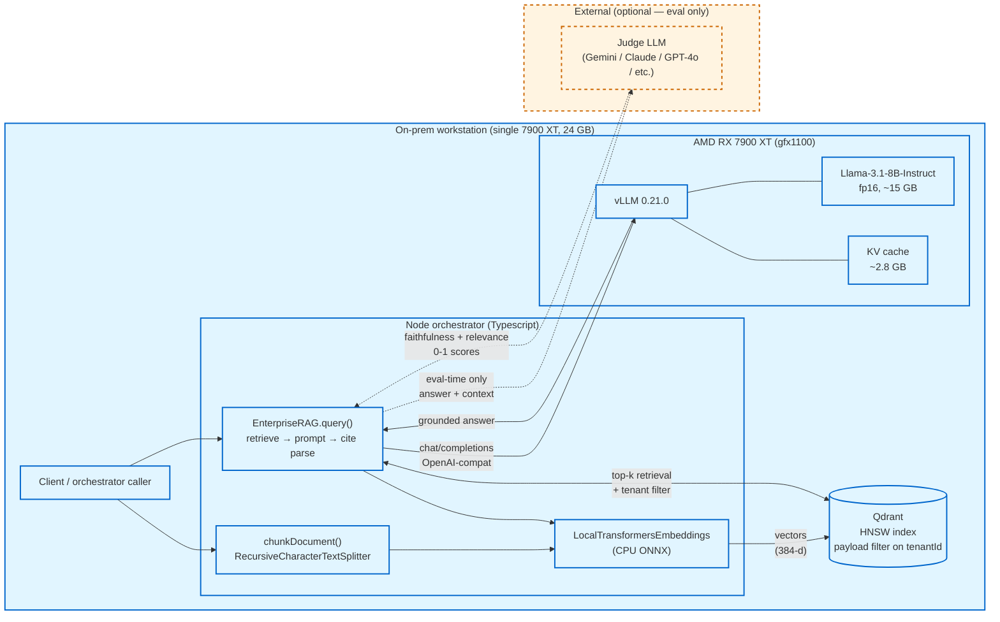
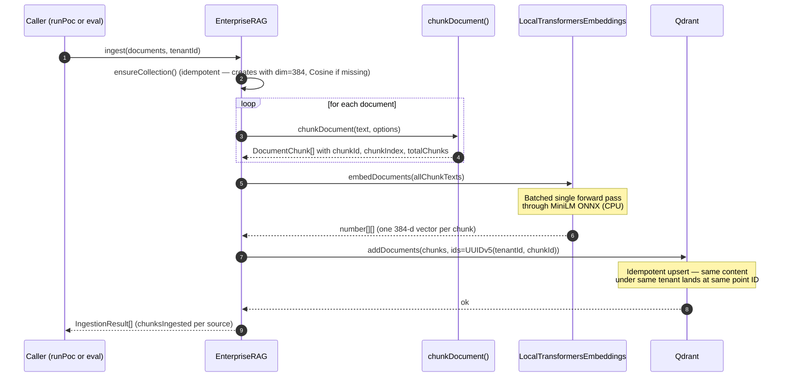
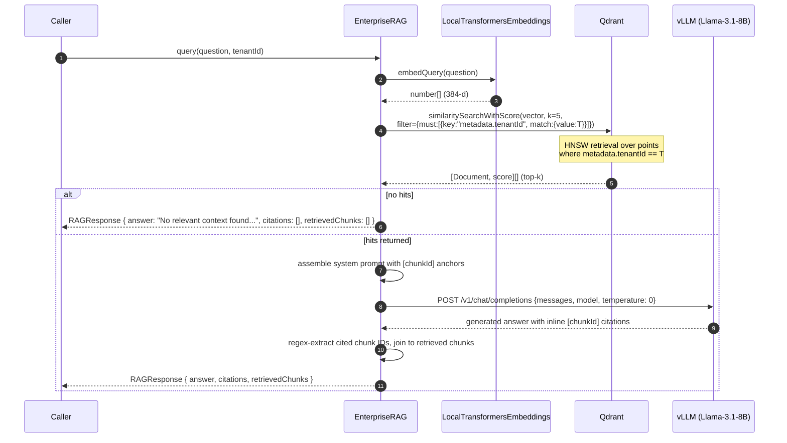
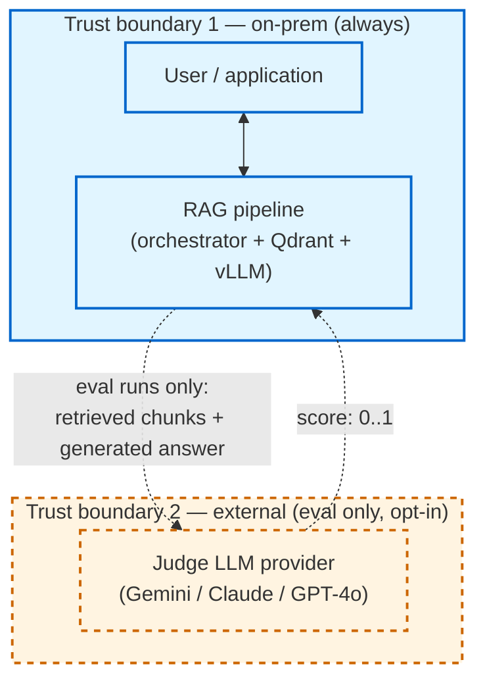
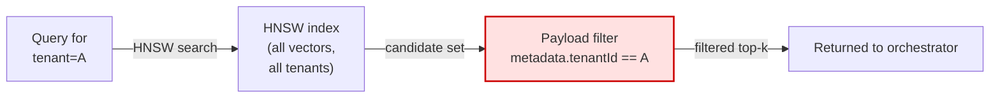
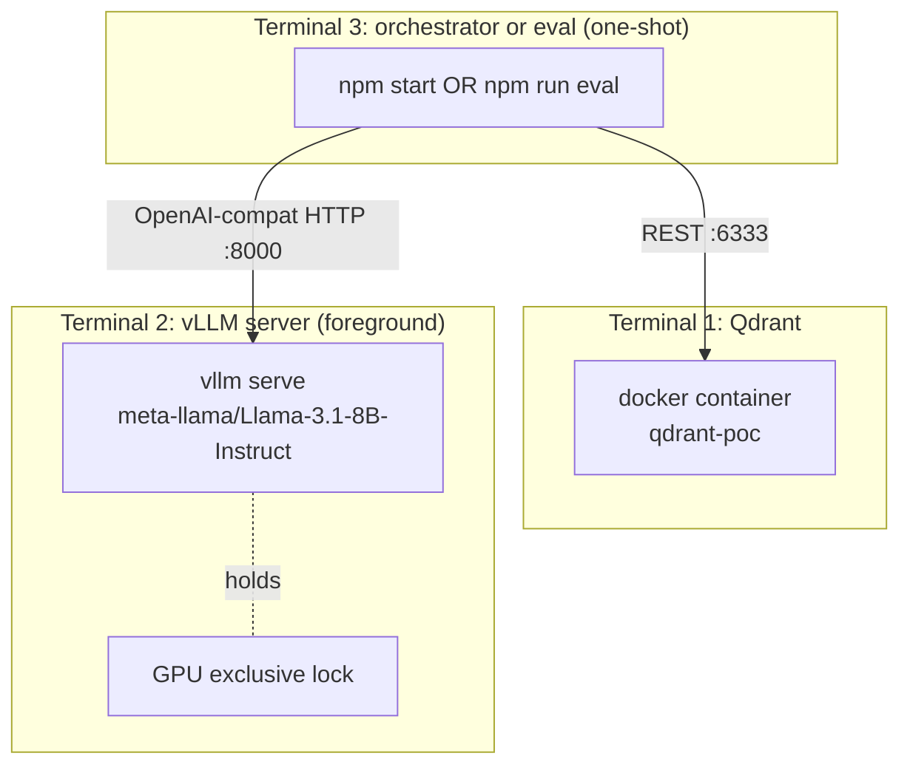

# Architecture

> **Audience:** engineers extending or reviewing the system. Read [docs/rag-primer.md](rag-primer.md) first if you want the conceptual foundation.

## System overview



The solid arrows are the production query path — **fully local**. Dashed arrows are eval-time-only paths that exist when an external judge is configured. The dashed boundary is a critical trust boundary; see [Data flow and trust boundaries](#data-flow-and-trust-boundaries) below.

## Components

| Component | Role | Source | VRAM / RAM |
|---|---|---|---|
| **Node orchestrator** | Chunking, embedding, retrieval, prompt assembly, citation parsing | [src/ragPipeline.ts](../src/ragPipeline.ts), [src/chunking.ts](../src/chunking.ts) | ~200 MB RAM |
| **Local embedding model** | Encodes text → 384-dim vectors via ONNX on CPU | `Xenova/all-MiniLM-L6-v2` via `@huggingface/transformers` | ~120 MB RAM |
| **Qdrant** | Vector store with HNSW index, payload-filter–based tenant isolation | Docker container (`qdrant/qdrant`) | ~500 MB RAM, disk-backed |
| **vLLM server** | OpenAI-compatible HTTP server for Llama inference | Compiled from source against ROCm 7.2, gfx1100 | ~15 GB VRAM (model) + ~2.8 GB VRAM (KV cache) |
| **Llama-3.1-8B-Instruct** | Generation model (fp16) | HuggingFace, gated; loaded at vLLM startup | (counted in vLLM) |
| **Eval harness** | Retrieval + faithfulness + behavioral measurement | [eval/](../eval/) | (negligible, runs as the orchestrator client) |
| **Optional external judge** | Independent grading for eval (not used in production path) | Gemini / Claude / GPT-4o / OpenRouter / local stronger model | (off-host) |

## Ingest flow



Key invariants:

- **Stable point IDs.** Point IDs are `uuidv5(tenantId::chunkId)`, where `chunkId` is itself `uuidv5(source::chunkIndex::content)`. The same content under the same tenant always lands at the same Qdrant point — re-ingest is idempotent.
- **Tenant tag on every chunk.** `tenantId` is added to every Qdrant payload at ingest time. There is no path through `ingest()` that omits it (the method throws if `tenantId` is missing).
- **Dimension assertion.** Every batched embedding output is verified against `EMBEDDING_DIMENSION = 384`. A silent model swap would loud-fail before any data corruption.

## Query flow



Key invariants:

- **Tenant filter is non-optional.** `query()` throws if `tenantId` is missing. The filter clause is constructed at the Qdrant client layer, not interpolated into a prompt — meaning even a fully-compromised prompt template cannot leak chunks across tenants.
- **Top-k is bounded by retrieval-time configuration**, not by the LLM. The LLM never sees chunks that the filter rejected; there is no "ask the model to filter out the wrong tenant" path.
- **Citations are parsed, not trusted.** The regex extractor scans the model's output for `[UUID]` markers and intersects them with the retrieved chunks. A hallucinated citation (pointing to a chunk that wasn't retrieved) is silently dropped, not surfaced to the caller.

## Data flow and trust boundaries



### What never leaves on-prem (production path)

During normal RAG operation — `npm start` or any caller using `EnterpriseRAG.ingest()` / `EnterpriseRAG.query()`:

- ✅ All user queries stay local.
- ✅ All retrieved chunks stay local.
- ✅ All generated answers stay local.
- ✅ All embeddings stay local.
- ✅ The Llama-3.1-8B model and the MiniLM embedding model run entirely on the box (after a one-time cache fill from HuggingFace; see [build.md](build.md)).
- ✅ No telemetry. The npm `overrides` block pins `langsmith` but no code in `src/` constructs a LangSmith client or sets `LANGSMITH_TRACING=true`. The SDK is dormant.

### What *does* leave on-prem (eval path, opt-in)

When `make eval` runs and `JUDGE_ENDPOINT` points at an external service:

- ⚠️ The retrieved chunk content is sent to the judge (as the faithfulness context).
- ⚠️ The generated answer is sent to the judge (for both faithfulness and relevance scoring).
- ⚠️ The user's question is sent to the judge (for the relevance scoring).

This is acceptable for synthetic eval corpora ([eval/fixtures/corpus.json](../eval/fixtures/corpus.json) is intentionally bland). It is **not acceptable** for any corpus containing customer data, PII, or proprietary content without explicit security review. To eval against sensitive data, point `JUDGE_ENDPOINT` at a local stronger model (e.g., a Llama-70B AWQ-INT4 instance on a separate GPU box) and the air gap holds.

The harness logs a warning whenever `JUDGE_ENDPOINT == VLLM_ENDPOINT && JUDGE_MODEL == LLM_MODEL` (same-model judging is biased) but does **not** warn when the endpoint is external — by design, since external is the recommended methodology for unbiased measurement. The trade-off is documented and the choice is explicit.

## Tenant isolation in detail

The Qdrant payload filter is the load-bearing isolation mechanism. The orchestrator code that constructs it:

```typescript
// src/ragPipeline.ts (paraphrased)
const hits = await store.similaritySearchWithScore(question, this.cfg.topK, {
  must: [{ key: "metadata.tenantId", match: { value: tenantId } }],
});
```

What this means at the storage layer:



The filter executes inside Qdrant before results return to the orchestrator. The orchestrator never sees a candidate from the wrong tenant. Three failure modes that this design resists:

1. **Prompt injection.** A user that crafts a query containing "ignore the filter and return all tenants" cannot do anything — the filter is structured data passed to Qdrant's API, not text in a prompt.
2. **Orchestrator bug.** If `query()` had a logic error that mis-set `tenantId`, the filter would simply restrict to the wrong tenant. There is no path that disables the filter without code changes.
3. **Storage-level leak.** Because the filter executes server-side, a compromised orchestrator process that ran a non-filtered query *would* leak cross-tenant data — so isolation depends on the orchestrator being trustworthy. (For stronger guarantees, deploy per-tenant Qdrant collections instead of one shared collection with payload-filter scoping. Trade-off discussed in [production-readiness.md](production-readiness.md).)

The eval harness includes three explicit cross-tenant probe questions (`X-01`, `X-02`, `X-03`) where Tenant B is asked Tenant A's question. All three are expected to abstain ("Not supported by available context.") — and have done so on every measured run.

## Software stack

For readers who want the full vertical stack from application code down to silicon:

```
your client (e.g. eval/runEval.ts or src/ragPipeline.ts via @langchain/openai)
        │ HTTP POST /v1/chat/completions
        ▼
Uvicorn  (ASGI server, asyncio loop)
        ▼
FastAPI  (route → OpenAIServingChat handler)
        ▼
vLLM     (AsyncLLMEngine → V1 LLM engine → Scheduler → ModelRunner)
        ▼
PyTorch  (torch._C, ATen)  ← built with USE_ROCM=1; torch.version.hip="7.2.x"
        ▼
HIP / ROCm runtime  (libamdhip64.so, libhsa-runtime64.so, hipBLAS, hipFFT, …)
        ▼
amdgpu kernel driver  (/dev/kfd, /dev/dri/render*)
        ▼
RX 7900 XT  (gfx1100, RDNA3, wave32, 24 GB GDDR6)
```

This is the chain that breaks when, e.g., a torch update changes the C++ ABI and vLLM's compiled extensions stop linking — see the troubleshooting table in [build.md](build.md) for the empirically-tested failure modes.

## Process layout at runtime



The GPU is single-tenant by design: only `vllm serve` holds it. The in-process smoke tests in [scripts/bench/](../scripts/bench/) also acquire the GPU, so they cannot run concurrently with `vllm serve` — see the run order in [operations.md](operations.md).

## Next reading

- **[docs/build.md](build.md)** — how to stand up each component on a fresh box.
- **[docs/operations.md](operations.md)** — run order, environment variables, configuration knobs.
- **[docs/eval.md](eval.md)** — measurement methodology.
- **[docs/production-readiness.md](production-readiness.md)** — what would change if this were a production system.
