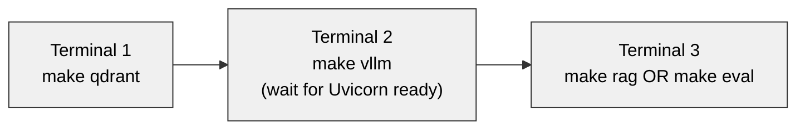

# Operations

> **Audience:** anyone running the system or trying to debug it. Assumes you've completed the [build](build.md) and have a working ROCm 7.2 + vLLM 0.21.0 + Qdrant + Node toolchain on the box.

## Run order

The GPU is single-tenant. Only one of {smoke tests, `vllm serve`, the AWQ benchmark} can hold it at a time. Start the long-running services in order, in separate terminals:



| Phase | Command | Holds GPU? | Persistent? | Notes |
|---|---|---|---|---|
| Sanity smoke (optional, in-process) | `make smoke-tiny` then `make smoke-llama` | Yes, during run | No | Validates the vLLM build. Stop before starting `make vllm`. |
| Qdrant | `make qdrant` | No | Yes (Docker daemon) | Detached container; persists across sessions until `make qdrant-stop`. |
| vLLM server | `make vllm` | Yes | Yes (foreground process) | Cold start ~20-30 s. Hold this terminal. |
| RAG pipeline | `make rag` | No | No (one-shot) | Talks to vLLM over HTTP. Re-runs are idempotent. |
| Eval harness | `make eval` | No | No (one-shot) | Wipes its own collection; safe to re-run. |

## Makefile targets

```bash
make help                 # list of targets
make install              # npm install + rocminfo gfx1100 check
make typecheck            # npx tsc --noEmit
make smoke-tiny           # opt-125m sanity (in-process)
make smoke-llama          # Llama-3.1-8B fp16 load (in-process)
make smoke                # smoke-tiny then smoke-llama
make bench                # Llama-3.1-8B AWQ-INT4 batched throughput probe
make qdrant               # docker run -d qdrant/qdrant
make qdrant-stop          # stop + remove the container (keeps the disk volume)
make vllm                 # vllm serve (foreground)
make rag                  # npm start (the demo pipeline)
make eval                 # npm run eval (eval harness)
make clean                # rm -rf dist node_modules
```

## Configuration — environment variables

Everything is env-driven; no code edits required to retarget. Defaults in parentheses.

### Orchestrator runtime — `src/ragPipeline.ts`

| Variable | Default | Purpose |
|---|---|---|
| `VLLM_ENDPOINT` | `http://127.0.0.1:8000/v1` | OpenAI-compatible vLLM URL. |
| `VLLM_API_KEY` | `EMPTY` | Required by the SDK; vLLM ignores it. Set when pointing at a real service. |
| `QDRANT_URL` | `http://127.0.0.1:6333` | Qdrant REST endpoint. |
| `QDRANT_COLLECTION` | `saas_docs` | Collection name. |
| `LLM_MODEL` | `meta-llama/Llama-3.1-8B-Instruct` | Must match the model the vLLM server was started with. |
| `EMBEDDING_MODEL` | `Xenova/all-MiniLM-L6-v2` | 384-d, 256-token ONNX model. |
| `RAG_TOP_K` | `5` | Chunks retrieved per query. |
| `RAG_CHUNK_SIZE` | `512` | Characters per chunk for splitting. |
| `RAG_CHUNK_OVERLAP` | `64` | Character overlap between chunks. |
| `RAG_TEMPERATURE` | `0` | Sampling temperature (0 = deterministic). |

### Eval harness — `eval/runEval.ts`

| Variable | Default | Purpose |
|---|---|---|
| `EVAL_COLLECTION` | `eval_corpus` | Qdrant collection name for eval runs. Wiped at start. |
| `JUDGE_ENDPOINT` | `$VLLM_ENDPOINT` | Judge endpoint — separable from the system-under-test endpoint. |
| `JUDGE_MODEL` | `$LLM_MODEL` | Judge model id. |
| `JUDGE_API_KEY` | `$VLLM_API_KEY` → `EMPTY` | Auth for the judge endpoint. Required for any external service. |
| `EVAL_VERBOSE` | unset | Log judge JSON-parse failures with the raw response. |

### External judge configurations

```bash
# Google AI Studio (Gemini 2.5 Flash) — fastest setup
JUDGE_ENDPOINT=https://generativelanguage.googleapis.com/v1beta/openai \
JUDGE_MODEL=gemini-2.5-flash \
JUDGE_API_KEY=AIzaSy... \
  make eval

# OpenAI
JUDGE_ENDPOINT=https://api.openai.com/v1 \
JUDGE_MODEL=gpt-4o-mini \
JUDGE_API_KEY=sk-proj-... \
  make eval

# Anthropic (OpenAI-compat layer)
JUDGE_ENDPOINT=https://api.anthropic.com/v1 \
JUDGE_MODEL=claude-haiku-4-5-20251001 \
JUDGE_API_KEY=sk-ant-api03-... \
  make eval

# OpenRouter (one key, any model)
JUDGE_ENDPOINT=https://openrouter.ai/api/v1 \
JUDGE_MODEL=anthropic/claude-sonnet-4-6 \
JUDGE_API_KEY=sk-or-v1-... \
  make eval
```

See [docs/eval.md](eval.md) for methodology trade-offs (especially the same-model bias issue) and what each metric actually measures.

## Verification — is the system healthy?

Three one-liners that should always succeed when the stack is up:

```bash
# 1. Qdrant
curl -s http://127.0.0.1:6333/healthz   # → "healthz check passed"

# 2. vLLM (model registered)
curl -s http://127.0.0.1:8000/v1/models | jq .data[].id
# → "meta-llama/Llama-3.1-8B-Instruct"

# 3. vLLM generation (round-trip a token)
curl -s http://127.0.0.1:8000/v1/chat/completions \
  -H 'Content-Type: application/json' \
  -d '{"model":"meta-llama/Llama-3.1-8B-Instruct","messages":[{"role":"user","content":"say hi"}],"max_tokens":5}' \
  | jq '.choices[0].message.content'
```

If any fails, the orchestrator will too. Fix that layer first.

## Inspecting the vector store

```bash
# Point count for a tenant-aware collection (after the demo pipeline run)
curl -s http://127.0.0.1:6333/collections/saas_docs | jq '.result.points_count'

# Browse points and their payloads
curl -s -X POST http://127.0.0.1:6333/collections/saas_docs/points/scroll \
  -H 'Content-Type: application/json' \
  -d '{"limit": 10, "with_payload": true}' \
  | jq '.result.points[] | {id, source: .payload.metadata.source, tenant: .payload.metadata.tenantId}'

# Delete pre-tenant-isolation legacy points (if migrating from a pre-PR#2 state)
curl -s -X POST http://127.0.0.1:6333/collections/saas_docs/points/delete \
  -H 'Content-Type: application/json' \
  -d '{"filter":{"must":[{"is_empty":{"key":"metadata.tenantId"}}]}}'
```

## Re-ingest and idempotency

The ingest path is idempotent by construction:

- Each chunk's Qdrant point ID is `uuidv5(tenantId::chunkId)` where `chunkId` is `uuidv5(source::index::content)`.
- Same `(tenant, source, content)` → same point ID → upsert (not duplicate).

Practical implication: re-running `make rag` or `make eval` is always safe. The point count stabilizes after the first ingest.

If you need a clean slate (e.g., after changing the embedding model — vectors from a different model are not interchangeable):

```bash
# Wipe a specific collection
docker exec qdrant-poc rm -rf /qdrant/storage/collections/saas_docs
docker restart qdrant-poc

# Or, via Qdrant API:
curl -s -X DELETE http://127.0.0.1:6333/collections/saas_docs

# Or, the entire Qdrant volume (nuclear):
make qdrant-stop
rm -rf qdrant_storage/
make qdrant
```

## Logs and diagnostics

### vLLM server logs

vLLM logs to stdout in `make vllm`'s terminal. Look for:

- `Initializing a V1 LLM engine (v0.21.0)` — engine started.
- `Using ROCM_ATTN backend` or `Found incompatible backend(s) [TURBOQUANT] ... Overriding with ROCM_ATTN` — attention backend correctly selected for gfx1100.
- `Uvicorn running on http://0.0.0.0:8000` — ready to serve.
- `Cannot use ROCm custom paged attention kernel, falling back to Triton implementation` — expected on RDNA3, harmless.
- `Triton kernel JIT compilation during inference` (first request only) — expected, latency spike on cold start.

### Qdrant logs

```bash
docker logs -f qdrant-poc
```

Mostly silent during normal operation. Useful when collections won't create or queries time out.

### Orchestrator logs

Plain `console.log` to stdout. The `[eval]` and `[tenant:...]` prefixes identify ingest and query lifecycle events.

## Common operational pitfalls

| Symptom | Likely cause | Action |
|---|---|---|
| `make vllm` hangs at startup | First-time model download from HuggingFace; or `HF_TOKEN` missing for gated model | Watch the terminal for download progress; verify `HF_TOKEN` is exported with read access to `meta-llama/Llama-3.1-8B-Instruct` |
| `make rag` returns "No relevant context found in the knowledge base for this tenant." | Empty collection or `tenantId` mismatch with ingested data | Run `make rag` once first to ingest, or verify tenant id matches |
| `points_count` drifts upward on each run | Pre-tenant-isolation legacy points from before PR #2 | Run the `is_empty` filter delete shown above |
| Eval reports `judge_same_as_llm: true` | `JUDGE_ENDPOINT` / `JUDGE_MODEL` not overridden | Set them (see external judge configurations above) — same-model judging is biased |
| `make eval` takes >10 min | Llama-8B is doing the judge calls (~25 s each × 20 calls) | Point `JUDGE_ENDPOINT` at a faster external service (Gemini Flash returns in <2 s) |
| GPU memory fragmentation between runs | vLLM held the GPU and exited uncleanly | Wait 10 s after Ctrl-C, or restart `vllm serve` |
| `Failed to import from vllm._C` | torch ABI mismatch with the compiled vLLM extensions | Rebuild — see [build.md troubleshooting](build.md#troubleshooting) |

## Air-gapped / offline operation

The stack runs without internet egress *after* the model cache is populated. To prepare for an air-gapped deployment:

1. **Pre-populate the HuggingFace cache** on a machine with internet:
   ```bash
   huggingface-cli download meta-llama/Llama-3.1-8B-Instruct
   huggingface-cli download Xenova/all-MiniLM-L6-v2
   ```
   The cache lives at `~/.cache/huggingface/`. Copy that directory to the air-gapped host at the same path.

2. **Set `TRANSFORMERS_OFFLINE=1`** in the runtime environment to prevent any HF Hub lookups at runtime.

3. **Disable the external judge** by leaving `JUDGE_ENDPOINT` at its default (the local vLLM). Accept the biased-judge methodology, or stand up a stronger local judge on a separate GPU box.

4. **Pre-pull the Docker image**:
   ```bash
   docker pull qdrant/qdrant
   docker save qdrant/qdrant > qdrant.tar
   # On the air-gapped host:
   docker load < qdrant.tar
   ```

5. **`npm install`** is the last network dependency. Run it once before going air-gapped; `node_modules/` is portable across machines with the same OS/arch.

## Next reading

- **[docs/build.md](build.md)** — from-scratch setup on a new machine.
- **[docs/eval.md](eval.md)** — interpreting eval results.
- **[docs/production-readiness.md](production-readiness.md)** — what changes for production.
